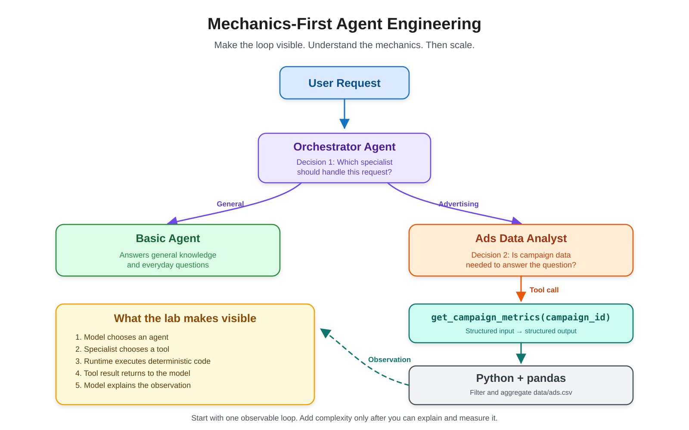

# Strands Agent Lab

A hands-on agent engineering project for learning how to build, observe, and evaluate AI agents using **Strands Agents**, **Ollama**, and locally hosted LLMs.

The project starts with a simple local agent and incrementally evolves into a multi-agent advertising data analysis system with tool calling, structured data access, observability, evaluation, and model routing.

> The goal is not just to build an agent, but to understand what happens inside the agent loop.

---

## Mechanics-First Agent Engineering

> Build the smallest observable agent loop, understand every decision and boundary, then scale the system.



The editable source is available in [`docs/assets/mechanics-first-agent-architecture.excalidraw`](docs/assets/mechanics-first-agent-architecture.excalidraw).

---

## Current Architecture

```text
                         User
                          │
                          ▼
                    Orchestrator
                          │
              ┌───────────┴───────────┐
              ▼                       ▼
        Basic Agent               Ads Agent
                                      │
                                      ▼
                           get_campaign_metrics
                                      │
                                      ▼
                                   pandas
                                      │
                                      ▼
                                  ads.csv
```

The orchestrator dynamically decides which specialist agent should handle the request.

The Ads Agent can then independently decide whether it needs to call a data tool.

This creates two levels of agentic decision-making:

```text
Orchestrator
    ↓
Which agent should handle this?

Ads Agent
    ↓
Which tool should I use?
```

---

## Tech Stack

- Python 3.12
- Strands Agents
- Ollama
- Qwen3 4B
- pandas
- uv

Everything currently runs locally.

---

## Project Structure

```text
strands-agent-lab/
│
├── data/
│   └── ads.csv
│
├── src/
│   └── strands_agent_lab/
│       │
│       ├── agents/
│       │   ├── basic_agent.py
│       │   ├── ads_agent.py
│       │   └── orchestrator.py
│       │
│       ├── models/
│       │   └── local_models.py
│       │
│       ├── tools/
│       │   └── ads_tools.py
│       │
│       └── observability/
│           └── __init__.py
│
├── tests/
├── evals/
├── pyproject.toml
└── README.md
```

### Folder Responsibilities

| Folder | Purpose |
|---|---|
| `agents/` | Agent definitions and orchestration |
| `models/` | LLM configuration |
| `tools/` | Executable capabilities available to agents |
| `data/` | Local datasets used by tools |
| `observability/` | Tracing and monitoring configuration |
| `tests/` | Validate that the code works correctly |
| `evals/` | Evaluate whether agents behave correctly |

---

## Model Configuration

The project currently uses **Qwen3 4B** through Ollama.

```python
from strands.models.ollama import OllamaModel


def get_qwen_4b():
    return OllamaModel(
        host="http://localhost:11434",
        model_id="qwen3:4b",
    )
```

Ollama hosts the model locally while Strands provides the agent runtime and tool-calling loop.

```text
Strands Agent
      │
      ▼
OllamaModel
      │
      ▼
localhost:11434
      │
      ▼
Qwen3:4B
```

---

## Agents

### Basic Agent

The Basic Agent handles general-purpose questions.

Its responsibilities are intentionally simple so that routing behavior can be observed clearly.

### Ads Data Analyst

The Ads Agent specializes in advertising campaign analysis.

It can reason about metrics such as:

- impressions
- clicks
- spend
- conversions
- revenue
- CTR
- CPC
- conversion rate
- ROAS

The agent is instructed to ground its answers in available data rather than inventing unavailable campaign metrics.

---

## Agents as Tools

The orchestrator receives specialist agents as tools:

```python
orchestrator = Agent(
    name="orchestrator",
    model=get_qwen_4b(),
    system_prompt=ORCHESTRATOR_INSTRUCTIONS,
    tools=[
        basic_agent.as_tool(),
        ads_agent.as_tool(),
    ],
)
```

From the orchestrator's perspective:

```text
Available tools
│
├── basic-agent
│
└── ads-data-analyst
```

However, each tool is itself a complete agent with its own:

```text
Agent
├── model
├── system prompt
├── tools
└── agent loop
```

This allows specialist agents to operate independently after delegation.

---

## Tool Calling

The Ads Agent currently has access to a campaign metrics tool.

```python
@tool
def get_campaign_metrics(campaign_id: str) -> dict:
    ...
```

The tool uses pandas to retrieve and aggregate campaign data from:

```text
data/ads.csv
```

The execution path is:

```text
User
 ↓
Orchestrator
 ↓
Ads Agent
 ↓
get_campaign_metrics("C003")
 ↓
pandas
 ↓
ads.csv
 ↓
structured campaign metrics
 ↓
Ads Agent
 ↓
Orchestrator
 ↓
User
```

This separation is intentional:

**LLM**

```text
What action should I take?
What tool should I use?
How should I explain the result?
```

**Python / pandas**

```text
Retrieve data
Filter rows
Aggregate values
Perform deterministic calculations
```

A key design principle of this project is:

> Use deterministic code for computation and use the LLM for decisions, reasoning, and explanation.

---

## Example

Run the orchestrator:

```bash
uv run python -m strands_agent_lab.agents.orchestrator
```

Example question:

```text
What are the performance metrics for campaign C003?
```

The orchestrator routes the request to the Ads Agent.

The Ads Agent retrieves the campaign data through its tool and produces an analysis.

Example aggregated metrics:

```text
Impressions: 27,000
Clicks:      1,745
Spend:       $335
Conversions: 113
Revenue:     $2,260
```

---

## Understanding the Agent Loop

An important part of this project is understanding that an agent invocation is not necessarily one LLM call.

A simplified execution looks like:

```text
Model
 ↓
Decision
 ↓
Tool / Agent
 ↓
Observation
 ↓
Model
 ↓
Final Response
```

With multiple agents, this can become:

```text
User
 ↓
Orchestrator Model
 ↓
Ads Agent
 ↓
Ads Agent Model
 ↓
Data Tool
 ↓
Ads Agent Model
 ↓
Orchestrator Model
 ↓
User
```

This has important implications for:

- latency
- token consumption
- debugging
- system complexity

More agents do not automatically mean a better system.

---

## Observability

The project currently uses Strands execution metrics to inspect agent behavior.

Example:

```python
result = orchestrator(question)

print(result.metrics.get_summary())
```

This allows inspection of information such as:

```text
Agent cycles
Tool calls
Tool execution time
Token usage
LLM latency
Errors
```

One experiment showed that a multi-agent request could require multiple model invocations even when the underlying pandas operation was nearly instantaneous.

This reinforces an important agent-engineering principle:

> Observe the system before optimizing the system.

More detailed tracing and observability will be added as the project evolves.

---

## Current Progress

### Phase 1 — Agent Plumbing

- [x] Local Ollama setup
- [x] Qwen3 4B integration
- [x] Basic Strands Agent
- [x] Specialized Ads Agent
- [x] Multi-agent orchestration
- [x] Agents as tools
- [x] Custom Python tool
- [x] Local CSV dataset
- [x] pandas data retrieval
- [x] Agent execution metrics and traces

### Phase 2 — Reliable Data Agent

- [ ] Structured agent outputs
- [ ] Typed contracts / schemas
- [ ] Deterministic derived metrics
- [ ] Campaign comparisons
- [ ] General analytical data capability
- [ ] Improved observability
- [ ] Agent evaluations

### Future Phases

Planned topics include:

- reusable agent skills
- richer campaign analysis
- visualization tools
- SQL-backed data access
- MCP
- context engineering
- model routing
- smaller vs. larger model selection
- guardrails
- human approval workflows
- production tracing
- latency and token benchmarking

---

## Learning Goals

This repository is designed to explore questions such as:

- What is the difference between an LLM and an agent?
- What makes a workflow agentic?
- How does an agent decide when to call a tool?
- How can one agent delegate work to another?
- When should agents exchange structured data instead of text?
- What should be deterministic code versus LLM reasoning?
- How much latency does multi-agent orchestration introduce?
- How should agent behavior be evaluated?
- When is a multi-agent architecture actually justified?

The repository will evolve incrementally as each concept is explored.

---

## Status

This is an active learning project.

The current implementation is intentionally small so individual agent decisions, tool calls, model invocations, and performance characteristics can be inspected before introducing more advanced abstractions.